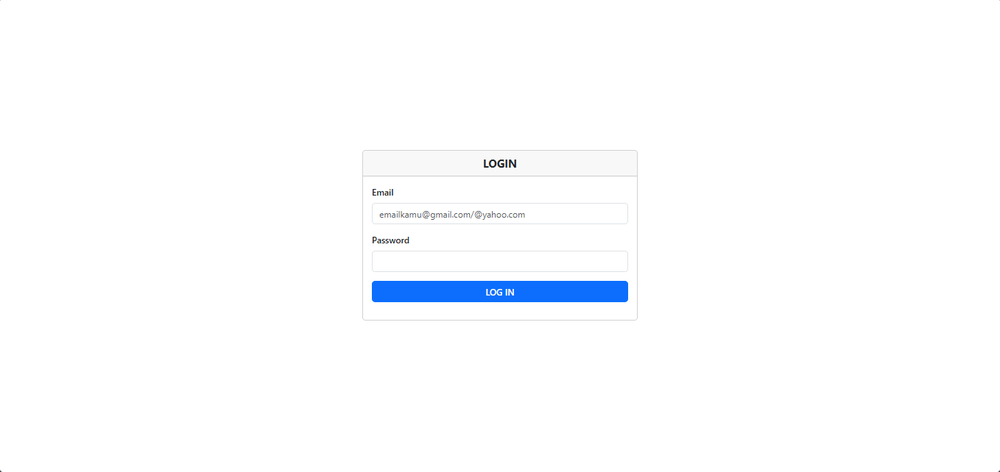
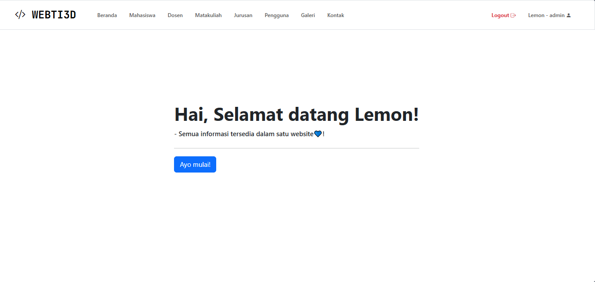
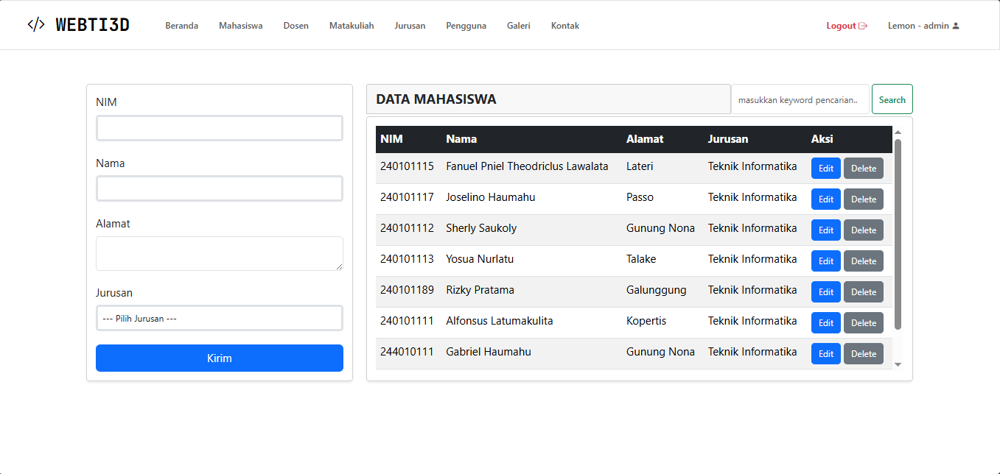
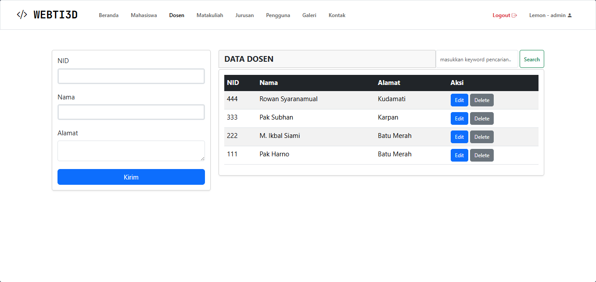
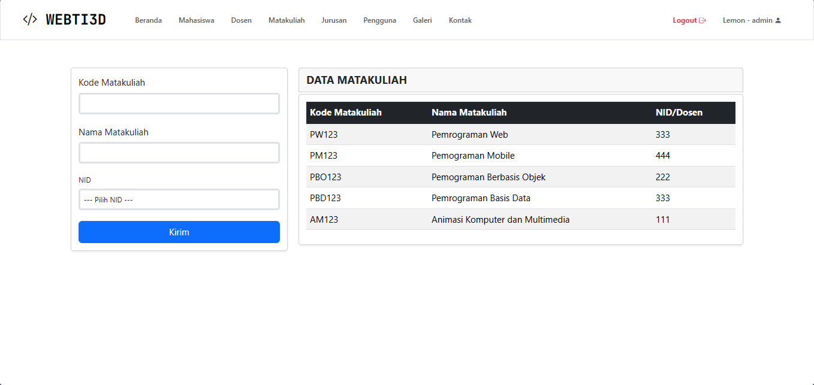
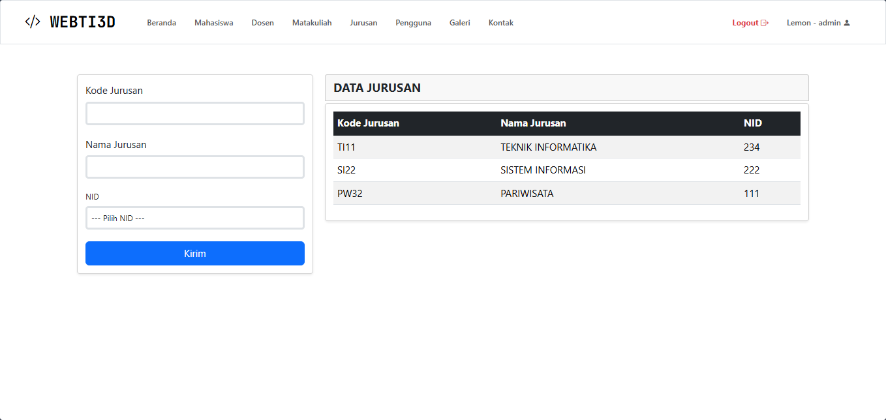
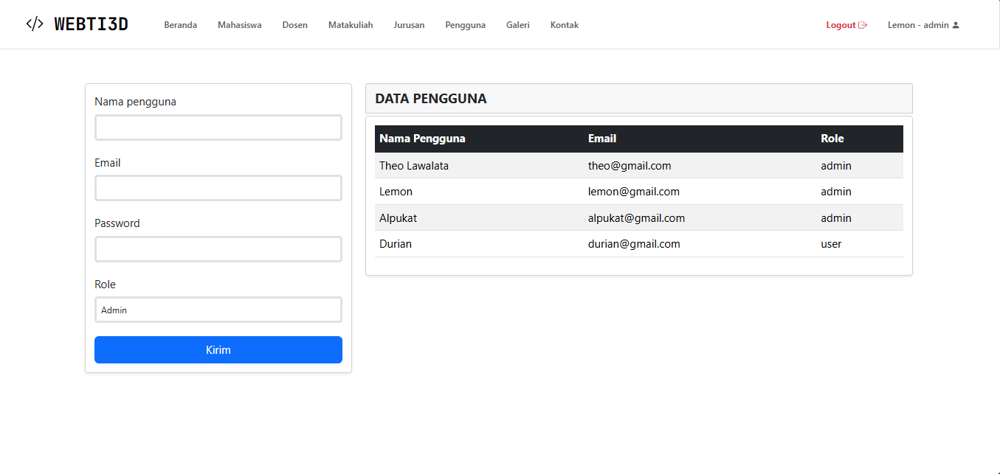
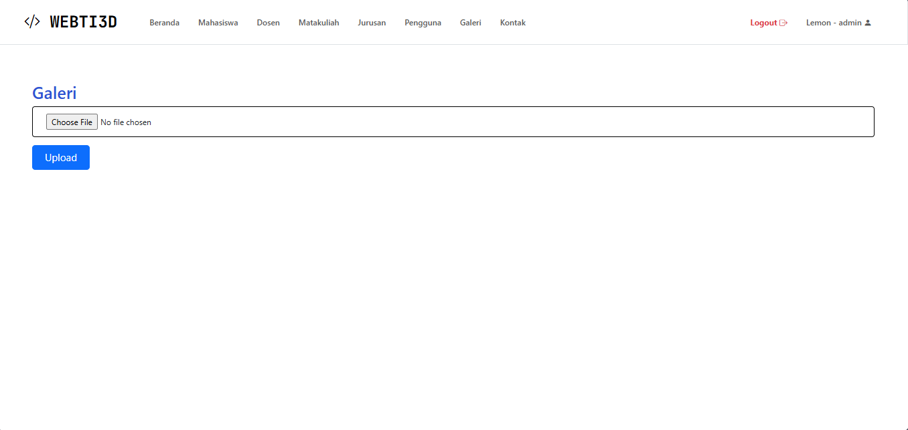
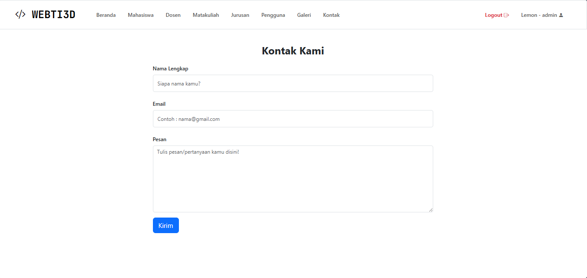

# Website Manajemen Data Mahasiswa & Dosen - UAS Pemrograman Web

Repository ini dibuat untuk menyelesaikan **UAS Pemrograman Web** dari dosen Pak **Subhan Ramadhani, S.Kom**

## Fitur Website

- Login dengan session
- Multi level user (Admin & User)
- CRUD + Search data Mahasiswa, Dosen, Matakuliah, Jurusan
- Hak akses berbeda tiap user

## Login Default

**Admin** : lemon@gmail.com | 123
**Admin** : alpukat@gmail.com | 123

**User** : durian@gmail.com | 123

## Screenshot Halaman

| Halaman    | Gambar                   |
| ---------- | ------------------------ |
| Login      |       |
| Beranda    |     |
| Mahasiswa  |   |
| Dosen      |       |
| Matakuliah |  |
| Jurusan    |     |
| Pengguna   |    |
| Galeri     |      |
| Kontak     |      |

---

_Dibuat untuk memenuhi UAS Pemrograman Web_
